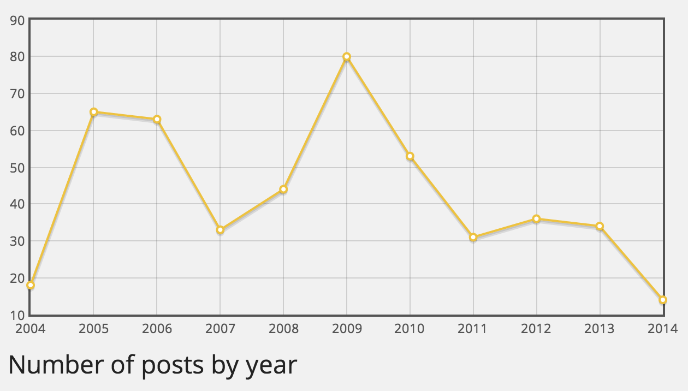
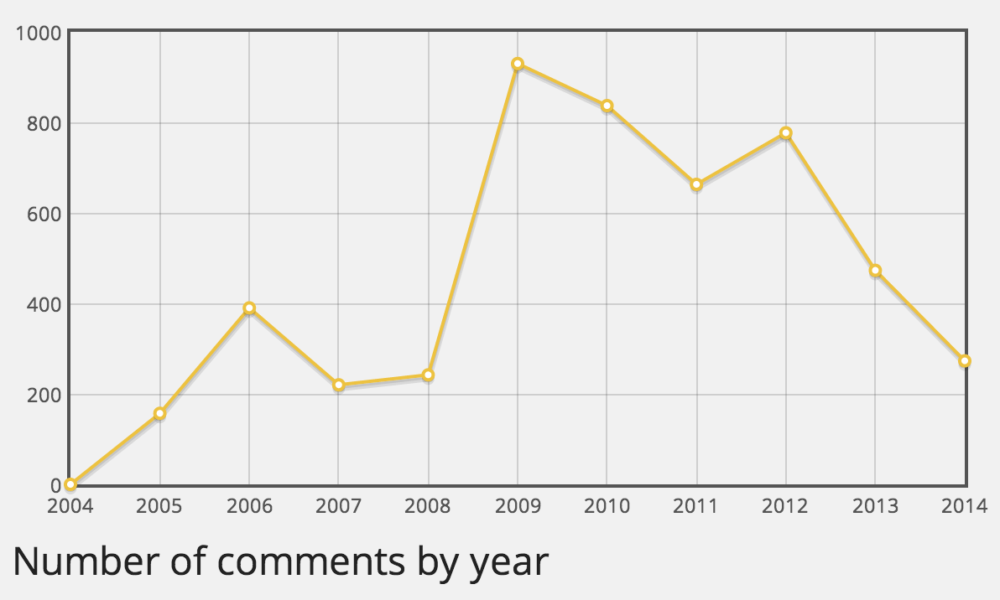
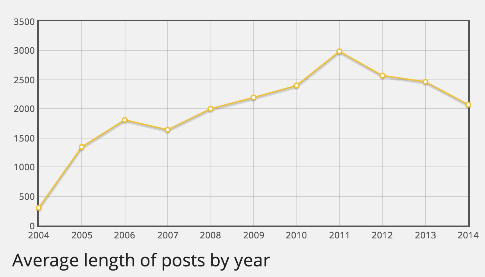

# WP Year End Stats #
**Contributors:** sudar  
**Tags:** stats, comments, posts  
**Requires at least:** 2.0  
**Tested up to:** 4.1  
**Donate Link:** http://sudarmuthu.com/if-you-wanna-thank-me  
**Stable tag:** 1.0  

Displays fancy stats about your blog which you can include in your year end review posts.

## Description ##

Displays fancy stats about your blog which you can include in your year end review posts.

**Requires PHP 5.3 or higher. Will not work in PHP 5.2.x**

### Features

The plugin currently supports the following stats

- Total number of posts per year
- Total number of comments per year
- Total number of words written per year
- Average length of posts per year

### Shortcode

You can use the following shortcode to display stats in your blog.

```
[yes_stats type="post_num" start_year="2004" end_year="2014" range="to" post_type="post" post_status="publish" title="Title of the graph" height="500" width="500" ]
```

The `yes_stats` shortcode can have the following attributes

- `type` - The type of graph. The following are the allowed values.
    - `post_num` - Number of posts by year (default)
    - `comment_num` - Number of posts by year
    - `post_avg_length` - Average length of posts by year
    - `post_totoal_length` - Total length of posts by year
- `start_year` - The first year for the graph (default: current year)
- `end_year` - The last year for the graph (default: current year)
- `range` - How the years should be treated. Possible values are `to` (default) and `and`
- `post_type` - The post type for which the graph should be generated (default: post)
- `post_status` - The post status for which the graph should be generated (default: publish)
- `title` - Title for the graph
- `height` - Height of the graph (Default: 500px)
- `width` - Width of the graph (Default: 500px)

### TODO

The following are the features that I am thinking of adding to the Plugin, when I get some free time. If you have any feature request or want to increase the priority of a particular feature, then let me know.

- Add more stats
- Make the graphs more configurable
- Cache the stats

### Support

- If you have found a bug/issue or have a feature request, then post them in [github issues][7]
- If you have a question about usage or need help to troubleshoot, then post in WordPress forums or leave a comment in [plugins's home page][1]
- If you like the Plugin, then kindly leave a review/feedback at [WordPress repo page][8].
- If you find this Plugin useful or and wanted to say thank you, then there are ways to [make me happy](http://sudarmuthu.com/if-you-wanna-thank-me) :) and I would really appreciate if you can do one of those.
- Checkout other [WordPress Plugins][5] that I have written
- If anything else, then contact me in [twitter][3].

 [1]: http://sudarmuthu.com/wordpress/wp-year-end-stats
 [3]: http://twitter.com/sudarmuthu
 [4]: http://sudarmuthu.com/blog
 [5]: http://sudarmuthu.com/wordpress
 [6]: https://github.com/sudar/wp-yearendstats
 [7]: https://github.com/sudar/wp-yearendstats/issues
 [8]: http://wordpress.org/extend/plugins/wp-yearendstats/

## Translation ##

The pot file is available with the Plugin. If you are willing to do translation for the Plugin,
use the pot file to create the .po files for your language and let me know.

### Credits

- Thanks to Alex King for his [blog stats SQL scripts](http://alexking.org/blog/2007/01/01/sql-for-blog-stats) and for the [inspiration](http://alexking.org/blog/2007/12/31/2007-in-review).
- Thanks to the excellent [Flot JavaScript](http://flotcharts.org/) library.

## Installation ##

The simplest way to install the plugin is to use the built-in automatic plugin installer. Go to plugins -> Add New and then enter the name of the plugin to automatically install it.

If for some reason the above method doesn't work then you can download the plugin as a zip file, extract it and then use your favourite FTP client and then upload the contents of the zip file to the wp-content/plugins/ directory of your WordPress installation and then activate the Plugin from Plugins page.

## Frequently Asked Questions ##

### Will this plugin work in PHP 5.2.x? ###

No. This plugin requires PHP 5.3 or higher.

### Will this plugin support PHP 5.2.x in future? ###

No. Please update your PHP version to 5.3 or higher. PHP 5.2.x is very old and has lot of security issues.

## Screenshots ##



The above screenshot shows the "Number of Posts by year" graph.



The above screenshot shows the "Number of Comments by year" graph.



The above screenshot shows the "Average length of posts by year" graph.


The above screenshot shows the "Total length of posts by year" graph.

## Readme Generator ##

This Readme file was generated using <a href = 'http://sudarmuthu.com/wordpress/wp-readme'>wp-readme</a>, which generates readme files for WordPress Plugins.
